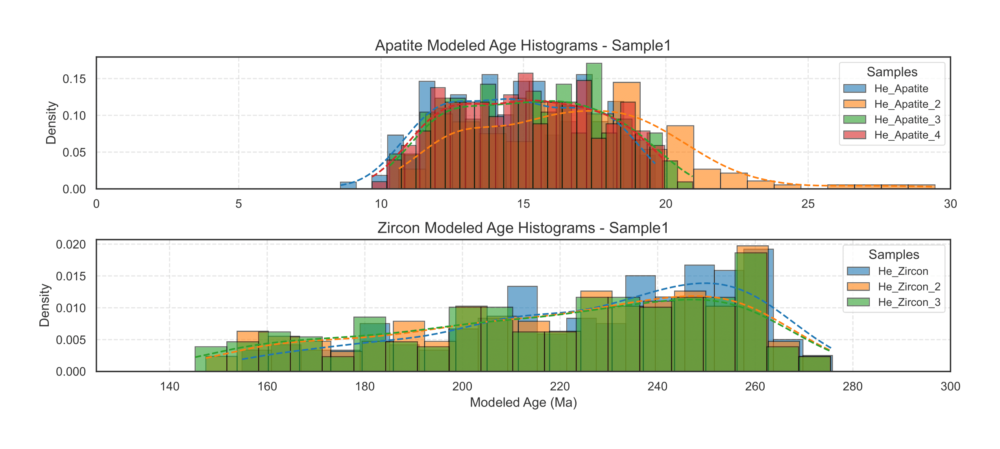
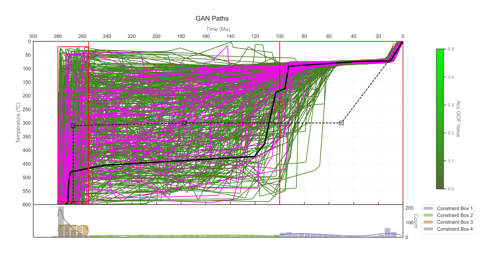
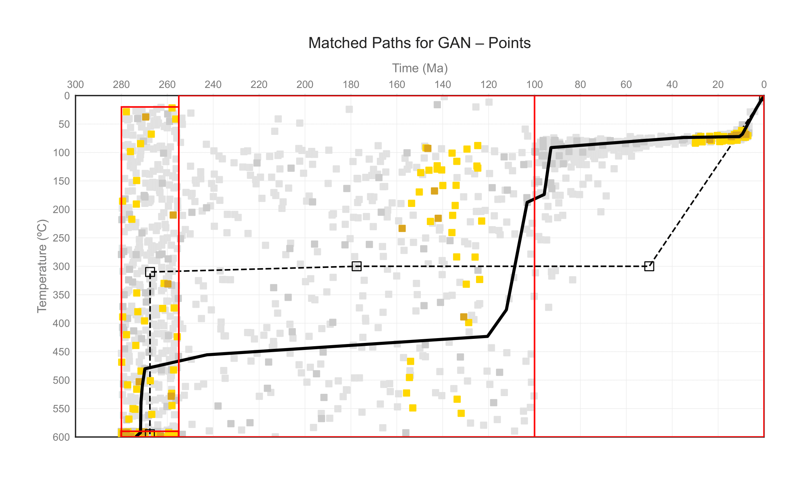
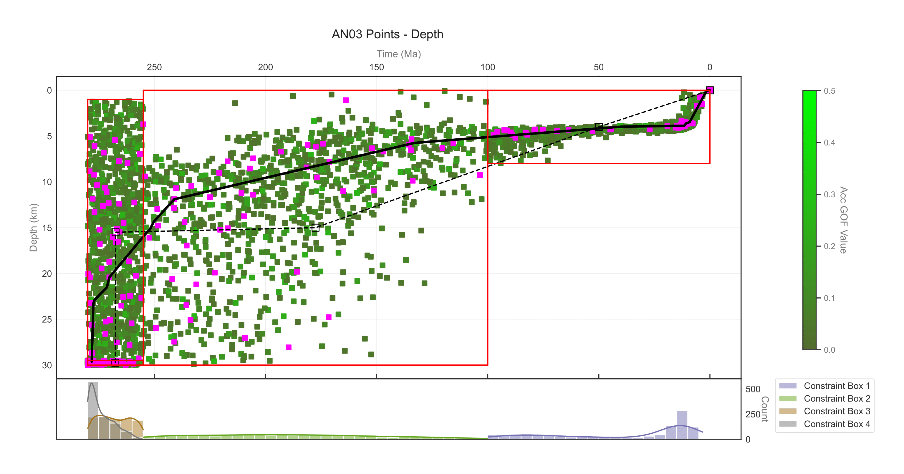
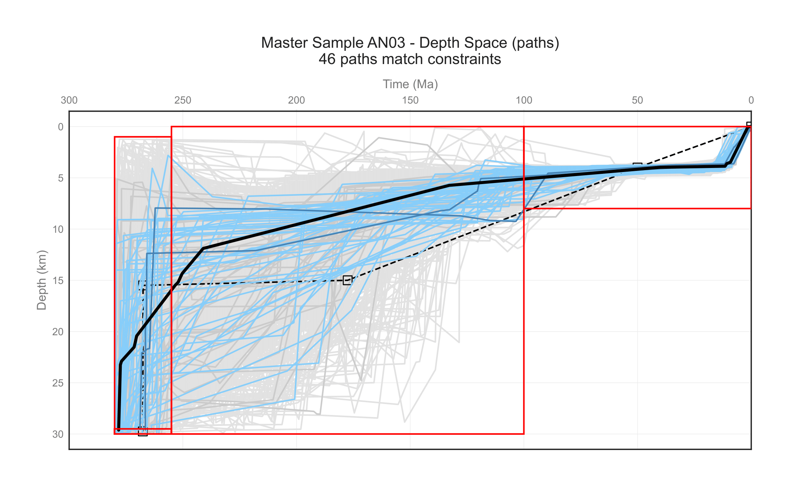

# <center> HeFTyPy  Data Visualization Module </center>

## Description

HeFTyPy is a Python module, designed for use via a Jupyter Notebook, for visualizing and analyzing HeFTy thermal modeling results. This module provides tools for plotting time-temperature/depth paths, model constraints, age distributions, and comparing measured versus modeled ages for both single-sample and multi-sample HeFTy models.


## Installation

### Required Python Version
To run HeFTyPy, we recommend using Anaconda, a comprehensive data science platform that includes most of the required Python modules (Python 3.6+).

### Full List of Dependencies
```python
numpy
seaborn
scipy
matplotlib
pathlib
collections
typing
os
```

## Single Sample Model Analysis

### Initialize a Single Sample Model
```python
from HeFTyFuncs import SingleSampleModel

# Create a single sample model
model = SingleSampleModel(
    file_name="path/to/hefty/file.txt",
    sample_name="Sample1"
)
```

### Selected Plotting Examples
#### Age Distribution Analysis
```python
# Plot modeled age distributions
model.plot_modeled_age_histograms(
    whatToPlot="both",     # Options: 'both', 'histogram', 'kde'
    pathsToPlot="all",     # Options: 'all', 'good', 'acc'
    ahe_x_bounds=(0, 30),  # Custom bounds for apatite He ages
    zhe_x_bounds=(125, 300)  # Custom bounds for zircon He ages
)
```
<p align="center">
  
</p>

```python
# Compare measured vs. modeled ages
measured_ages = [15.1, 25.8, 12.8, 15.0, 204.6, 245.2, 243.5]  # Must match number of samples
model.plot_measured_vs_modeled(
    measured_sample_ages=measured_ages,
    pathsToPlot="all",
    color_palette="Set1",
    show_1v1_line = 'both' # Options: 'line', 'point', 'both' or None
)
```
<p align="center">
  
</p>

#### Basic Path Plotting
```python
# Plot time-temperature paths
model.plotSingleSamplePathData(
    plot_type="paths",
    y_variable="temp",
    pathsToPlot="all",  # Options: 'all', 'good', 'acc'
    plotAgeHistogram = True
)
```
<p align="center">
  
</p>


#### Identify Path Families
```python
# Find paths that pass through specific constraints
matched_paths = model.identifyPathFamilies(
    plot_type="points",
    y_variable="temp",
    c1_x=(30, 0),   # Time constraint: 30-0 Ma
    c1_y=(100, 50),  # Temperature constraint: 100-50
    c2_x=(160, 120),  # Second time constraint
    c2_y=None # Second temperature constraint
)
```
<p align="center">
  
</p>

## Multi-Sample Model Analysis

### Initialize a Multi-Sample Model
```python
from HeFTyFuncsClasses import MultiSampleModel

# Create a multi-sample model
multi_model = MultiSampleModel(
    folder_path="path/to/hefty/files/",
)

# View available samples and their data types
multi_model.list_samples_and_types()
```
### Key Concepts for Multi-Sample Models
1. **Master Sample**: The module automatically identifies a "master sample" - a sample that has both temperature and depth data. This master sample serves as a reference for multi-sample analyses.

2. **Data Organization**: Each sample can have data in temperature space ('temp'), depth space ('depth'), or both. The module keeps track of which samples have which data types.

3. **Inter-Sample Relationships**: The module enables visualizing and analyzing relationships between different samples, such as comparing best-fit paths or identifying path families across samples.

### Selected Plotting Examples
#### Visualize Individual Sample Data
```python
# Plot thermal history for a specific sample
multi_model.plotMultiSamplePathData(
    sample="Sample1",
    plot_type="points",      # Options: 'paths', 'points', 'envelopes'
    y_variable="depth",      # Options: 'temp', 'depth' (depth only for master sample)
    pathsToPlot="all",      # Options: 'all', 'good', 'acc'
    plotOtherBestFitPaths=True,  # Show best paths from other samples
    otherBestPathColor="dodgerblue"
)
```
<p align="center">
  
</p>

#### Identify Path Families Across Samples
This module allows the user to identify path families based on constraints in the master sample, then visualize these paths in any sample of the model.

```python
# Identify paths meeting specific constraints in the master sample
# then visualize those constraints in any sample
matched_paths = multi_model.identifyMultiSamplePathFamilies(
    sample_name="Sample1",   # Can be master sample or any other sample
    plot_type="paths",       # Options: 'paths', 'points' (points only for master sample in depth space)
    y_variable="depth",       # Options: 'temp', 'depth' (depth only for master sample)
    
    # Constraints applied to master sample in depth space
    c1_x=(50, 0),            # Time constraint 1: 50-0 Ma
    c1_y=(5, 3),             # Depth constraint 1: 5-3 km
    c2_x=(125, 100),         # Time constraint 2: 120-80 Ma
    c2_y=(10, 0),            # Depth constraint 2: 10-0 km
    
    # Visualization options
    showOtherBestPaths=True,
    good_match_color="steelblue",
    acc_match_color="lightskyblue",
    otherBestPathColor="dodgerblue"
)
```
<p align="center">
  
</p>

## References

Example data from [Mackaman-Lofland, C., Lossada, A. C., Fosdick, J. C., Litvak, V. D., Rodríguez, M. P., del Llano, M. B., ... & Giambiagi, L. (2024). Unraveling the tectonic evolution of the Andean hinterland (Argentina and Chile, 30° S) using multi-sample thermal history models. Earth and Planetary Science Letters, 643, 118888.](https://www.sciencedirect.com/science/article/pii/S0012821X24003212)

Other References incldue:
- [Ketcham, R.A., 2005. Forward and inverse modeling of low-temperature thermochronometry data. Rev. Mineral. Geochem. 58 (1), 275–314.](https://pubs.geoscienceworld.org/msa/rimg/article-abstract/58/1/275/87556/Forward-and-Inverse-Modeling-of-Low-Temperature)
- [Ketcham, R.A., 2024. Thermal history inversion from thermochronometric data and complementary information: new methods and recommended practices. Chem. Geol. 653, 122042.](https://www.sciencedirect.com/science/article/pii/S0009254124001220)


## Support

For questions and support, please email samrobbins13@gmail.com with a detailed description of the ask and any accompanying data necessary to provide support. All data will be kept in confidence. 

## License
HeFTyPy is licensed under the Apache License 2.0.